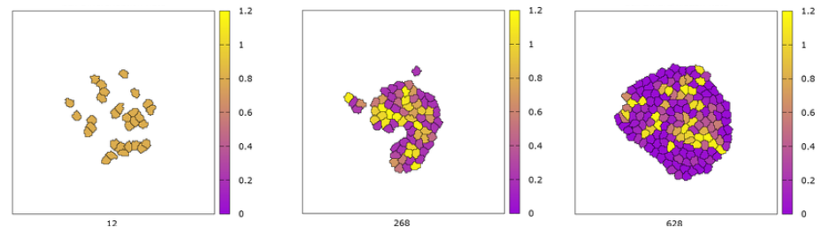
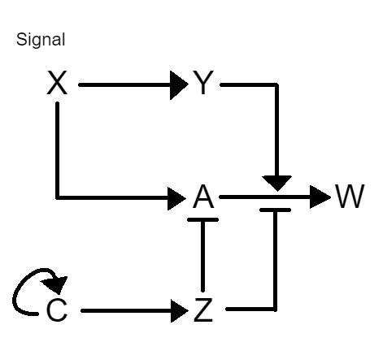

# HSC-Simulation-Pipeline
Research results of a simulation pipeline for hematopoietic stem cells. The research was conducted in a team of 4 (Kyle Palacios, Janet L. He, Qais Alsharif, and I) under the guidance of the graduate researcher Tiam Heydari @UBC. The project is falls under the subject the biomedical engineering, while my focus was on creating the cellular and ODE simulation. The final poster was presented at the 2023 MURC research conference held at UBC.

## Abstract
Hematopoietic stem cells (HSCs) are a type of stem cell that can develop into any type of blood
cell. The ability to regulate HSC function can be pivotal to sustaining proper blood production
and homeostasis in an organism over its lifetime. This study aims to develop a framework
whereby information about HSCs, or any differentiating cell can be collected and analyzed. To
do so, the study utilized single-cell RNA sequencing (scRNA-seq), Cell-cell communication
inference (CCC inference), Ordinary differential equations (ODE), and a Cellular Potts model
(CPM). ScRNA-seq was used to determine the gene expression profile of individual
hematopoietic stem cells. Specifically, scRNA-seq was performed on Peripheral Blood
Mononuclear Cells. Results from scRNA-seq determined the genes most commonly expressed in
mature blood cells. CCC was performed using the CellChat package in R to investigate the
particular interactions of these genes involved in hematopoietic stem cell differentiation. The
interactions between the genes were then modeled using a system of ordinary differential
equations and visualized using Python. In order to validate our findings, a CPM was then created
with Morpheus to model the cellular system in real-time. The use of a multiscale CPM can
analyze the emergent and qualitative behavior of a group of cells through different cell-cell
interaction pathways. Specifically in this project, a CPM model was created to analyze the
proliferative behavior of Myeloid Progenitor Cells, while building a framework to study Notch,
CD99, diffusive signaling, and other cell interaction pathways in the future.

## Summary of Results
We were able to develop a rudimentary framework that is able to process raw cellular data, process it through statistical means, generate a system of ODEs, and combine everything in a multi-scale CPM model. Focusing on the CPM part, videos of the simulation can be found in the `Simulation Videos` folder. A more detailed overview can be found in the poster pdf `UBC MURC Poster V4 - ID 257.pdf`. Below are some summary examples:

https://user-images.githubusercontent.com/65196939/234496577-4a09897b-d81c-437a-bcb5-b14ac7b262b3.mp4

https://user-images.githubusercontent.com/65196939/234496603-c285f47b-7eab-4c90-85f5-d045d52382b9.mp4

## Additional Research
Aside from the formal poster, some individual side research was conducted about a theoretical gene regulatory network that can calculate the signal average over a given time interval. Full details can be found in the interactive jupyter notebook `average_grn.ipynb`.

 </img>

$$\begin{align}
\frac{dY}{dt} &= r_x X - \gamma_y Y,\\
\frac{dC}{dt} &= r_{cc} \frac{k_c^n C^n}{k_c^n+C^n} - \gamma_c C,\\
\frac{dZ}{dt} &= r_c C - \gamma_z Z,\\
\frac{dA}{dt} &= \frac{r_{ax}\cdot k_x}{k_x+Z} X - \frac{r_{ay}\cdot k_y^2}{k_y^2+Z^2} Y - \gamma_z A.\\
\end{align}$$
